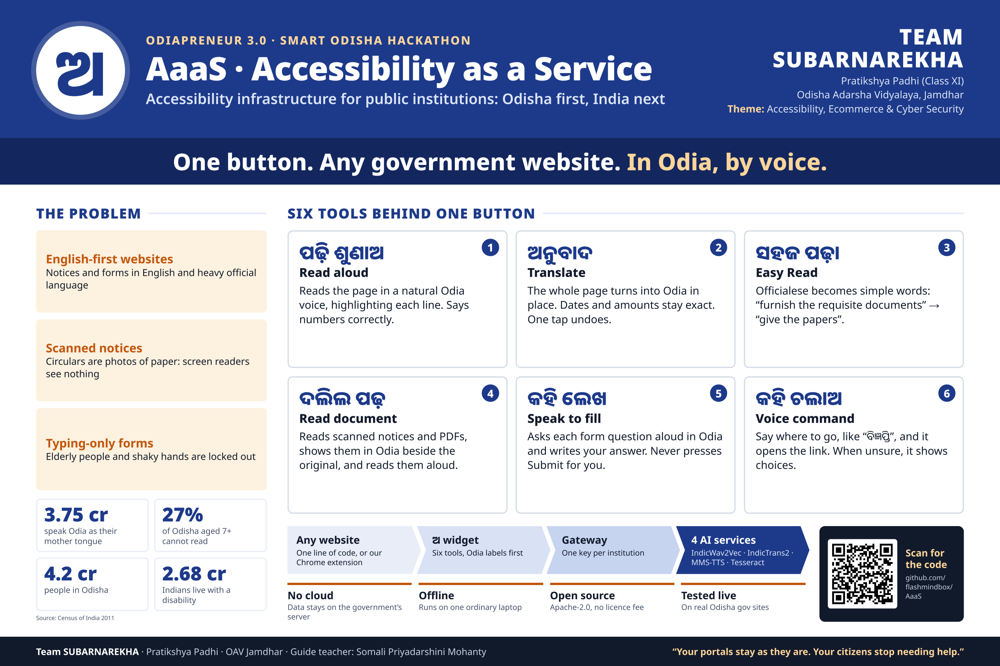

# AaaS — Accessibility as a Service

> One floating ଅ button on any government website that reads pages aloud in
> Odia, translates them, simplifies them, reads scanned notices, fills forms
> by voice, and navigates by voice — backed by on-prem Indic AI services.
> Built for Odisha, designed for every Indian public institution.

**Team:** SUBARNAREKHA — Pratikshya Padhi (Class XI), Odisha Adarsha Vidyalaya,
Jamdhar · **Guide teacher:** Somali Priyadarshini Mohanty ·
**Event:** Odiapreneur 3.0 (Smart Odisha Hackathon), theme *Accessibility,
Ecommerce & Cyber Security* · **License:** Apache-2.0 · **Status:** working demo —
widget + extension + four services, verified on real Odisha government sites



## Why this exists

Every Indian university, exam board, and government portal builds its own
(usually poor, usually absent) accessibility. That leaves millions of citizens
with disabilities, with learning differences, or who speak languages other
than English unable to use their own government's digital services — and the
most important documents are often *scans*, invisible to every assistive tool.
AaaS builds the assistive layer **once, centrally**: any site switches it on
with one script tag, and our browser extension covers the sites that haven't.

## What works today

| Feature (widget tile) | What it does |
|---|---|
| ପଢ଼ି ଶୁଣାଅ · **Read aloud** | Speaks the page in Odia/Hindi/English, highlights each block as it reads, ⏮/⏭ skip & replay, pause |
| ଅନୁବାଦ · **Translate → Odia** | Whole-page in-place translation (AI4Bharat IndicTrans2), one-tap ↺ undo |
| ସହଜ ପଢ଼ା · **Easy Read** | Rule-based plain-language rewriting, offline, same language as the page, ↺ undo |
| ଦଲିଲ ପଢ଼ · **Read document** | Finds scans/PDFs, OCRs them (Tesseract), shows original and translation side by side, reads aloud with per-page highlight |
| କହି ଲେଖ · **Speak to fill** | Guided voice form filling: asks each field aloud, transliterates names (never translates them), parses spoken numbers, never auto-submits |
| କହି ଚଲାଅ · **Voice command** | Voice navigation with phonetic matching (English links heard through Odia ears), reaches carousel/menu links, offers "did you mean" buttons instead of dead ends |

Plus **Reading comfort**: OpenDyslexic "Comfortable letters" mode, a reading
ruler, hover/selection speech — and a keyboard-shortcuts overlay.

## Architecture

```
browser ──> widget (520 KB vanilla JS, Shadow DOM)  or  MV3 extension
                     │  X-API-Key
                     ▼
            gateway :8000 ── static demo sites + catch-all proxy
             ├── tts :8001        Meta MMS-TTS (or/hi/en) + Odia number speech
             ├── stt :8002        AI4Bharat IndicWav2Vec (Odia)
             └── translate :8003  AI4Bharat IndicTrans2 + /simplify + /ocr
```

Everything runs on-prem (one laptop for the demo; a state data centre in
production). Every engine has a deterministic mock fallback, so the system
degrades honestly instead of dying. Client (IndexedDB) and server caches make
repeated operations instant.

## Quickstart

```bat
:: Windows, from the repo root — starts all four services in dev mode
start-dev.bat
```

Then open <http://127.0.0.1:8000/demo/> and click the ଅ button on any demo
page. Primary demos:

- `/demo/real-jajpur/` — mirror of the real Jajpur district portal
- `/demo/bse-odisha/` — mirror of BSE Odisha (has the scanned 2-page circular)
- `/demo/jajpur-collectorate/` — has the grievance form for voice filling

Per-service setup (models, HF tokens, Tesseract) is documented in each
service's README under [`services/`](./services). The zero-install judge
bundle is built by `python scripts/build_bundle.py` → `dist/AaaS-Demo/`
(see [`docs/bundle-build.md`](./docs/bundle-build.md)).

### Browser extension (any real website)

```
chrome://extensions → Developer mode → Load unpacked → apps/extension/
```

Injects the same widget into any site — we verified it on
jajpur.odisha.gov.in, bseodisha.ac.in, odisha.gov.in, ssepd.odisha.gov.in and
india.gov.in. See [`apps/extension/README.md`](./apps/extension/README.md).

## Repository layout

```
apps/
  widget/       the ଅ widget (src → built dist via scripts/build_widget.py)
  extension/    MV3 browser extension (ships the same widget)
  demo-sites/   mirrored government sites + fixtures served by the gateway
  admin/        minimal admin/demo landing pages
services/
  gateway/      auth, tenancy, static hosting, catch-all proxy
  tts/          Meta MMS-TTS + Odia number verbalization + script splicing
  stt/          AI4Bharat IndicWav2Vec (mock fallback)
  translate/    AI4Bharat IndicTrans2 + rule-based /simplify + Tesseract /ocr
scripts/        build_widget.py, build_bundle.py, demo fixtures
hackathon/      demo script, pitch, judge Q&A, presenter brief
docs/           plan-v2 (current plan), bundle build, install guides, compliance
```

## Testing

```bash
# widget (pure-function smoke suites)
node apps/widget/tests/dyslexia_smoke.js     # + ruler, voice_match, ocr_pick, form_fill

# services (per service)
cd services/translate && python -m pytest    # same for tts, stt, gateway
```

243 checks at last count: 119 widget smoke checks + 124 service tests (gateway 34, TTS 36, translate 52, STT 2).

## Read more

- [`docs/plan-v2.md`](./docs/plan-v2.md) — the current technical plan
- [`hackathon/DEMO_SCRIPT.md`](./hackathon/DEMO_SCRIPT.md) — the live demo, scene by scene
- [`WHAT_WE_ARE_BUILDING.md`](./WHAT_WE_ARE_BUILDING.md) — original vision (historical; see plan-v2 for what shipped)
- [`docs/`](./docs) — threat model, DPDP data-flow, WCAG checklist
